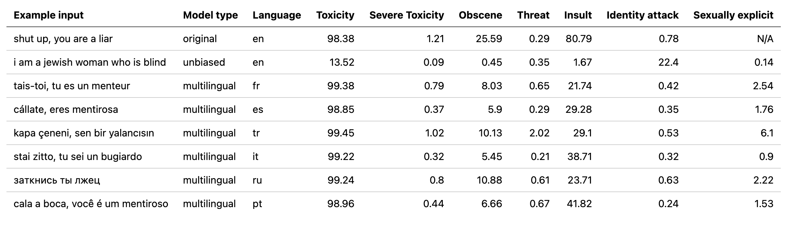
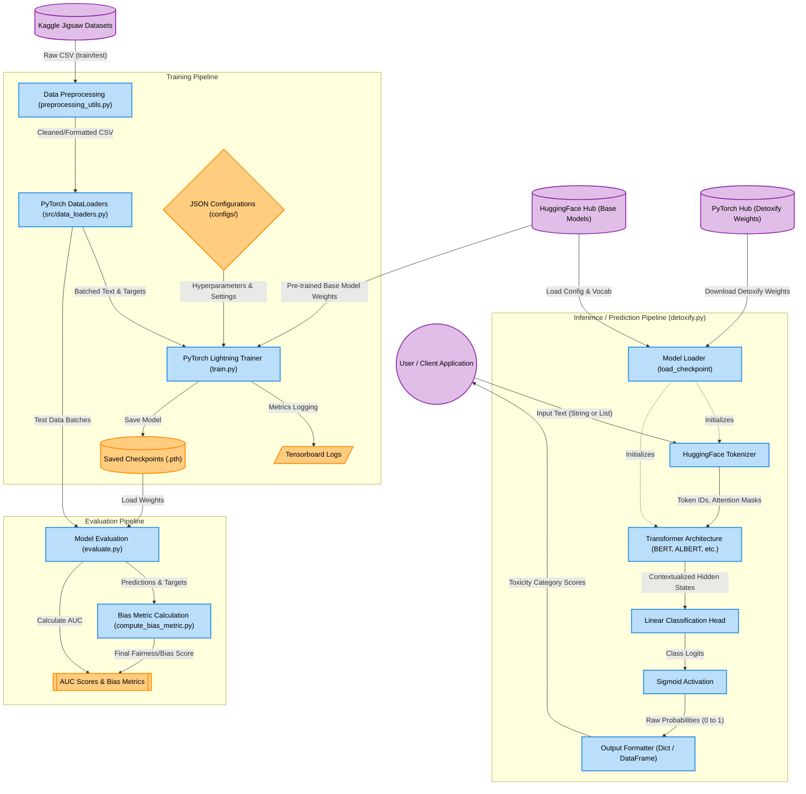

<div align="center">
  
  
  # Detoxify
  
  **Toxic Comment Classification with PyTorch Lightning and Transformers**
  
  [](https://badge.fury.io/py/detoxify)
  
  [](https://opensource.org/licenses/Apache-2.0)
  
  
  [Installation](#installation) • 
  [Quick Start](#quick-start) • 
  [Models](#models--challenges) • 
  [Data Flow Diagram](#data-flow-diagram) • 
  [Training](#training) • 
  [Limitations](#limitations--ethical-considerations)
</div>

---

## Overview

**Detoxify** provides highly accurate, pre-trained models to detect toxic comments across multiple challenges. Built by [Unitary](https://www.unitary.ai/) to combat harmful content online, it leverages the power of state-of-the-art transformer models (BERT, RoBERTa, ALBERT, XLM-R).

Whether you are building a moderation tool or conducting research on unintended bias, Detoxify offers an out-of-the-box solution that is easy to deploy and use.

---

## Installation

Install Detoxify quickly via `pip`:

```bash
pip install detoxify
```

For development and training purposes, install from source:

```bash
git clone https://github.com/unitaryai/detoxify
cd detoxify
python3 -m venv toxic-env
source toxic-env/bin/activate
pip install -e '.[dev]'
```

---

## Quick Start

Detoxify makes predictions incredibly simple. You can test it on a single string or a list of strings.

```python
from detoxify import Detoxify
import pandas as pd

# 1. Basic Prediction (Original Model)
results = Detoxify('original').predict('I love working with open source!')
print(results)

# 2. Unbiased Model on multiple sentences
texts = ['shut up, you liar', 'I am a jewish woman who is blind']
unbiased_results = Detoxify('unbiased').predict(texts)

# 3. Multilingual Model (supports 7 languages)
multilingual_texts = [
    'tais toi, tu es un menteur', 
    'ben kör bir yahudi kadınıyım'
]
multilingual_results = Detoxify('multilingual').predict(multilingual_texts)

# Display results nicely as a DataFrame
df = pd.DataFrame(unbiased_results, index=texts).round(5)
print(df)
```

### Running via CLI
You can also run inference directly from the command line:

```bash
# Predict a single text
python run_prediction.py --input "example comment" --model_name original

# Save predictions for a batch of comments to a CSV file
python run_prediction.py --input test_set.txt --model_name original --save_to results.csv
```

---

## Data Flow Diagram

The following comprehensive Data Flow Diagram (DFD) illustrates the complete architecture of the Detoxify project, including the **Training**, **Evaluation**, and **Inference** pipelines.



---

## Models & Challenges

Detoxify provides several models tailored to different datasets from the popular Kaggle Jigsaw challenges.

| Model Name       | Base Architecture   | Target Challenge | Description |
|:----------------:|:-------------------:|:-----------------|:------------|
| `original`       | `bert-base-uncased` | [Toxic Comment Classification](https://www.kaggle.com/c/jigsaw-toxic-comment-classification-challenge) | Detects general toxicity, threats, obscenity, insults, etc. |
| `original-small` | `albert-base-v2`    | Toxic Comment Classification | Lightweight version of the `original` model. |
| `unbiased`       | `roberta-base`      | [Unintended Bias](https://www.kaggle.com/c/jigsaw-unintended-bias-in-toxicity-classification) | Minimizes bias across identity mentions (e.g., race, gender, religion). |
| `unbiased-small` | `albert-base-v2`    | Unintended Bias | Lightweight version of the `unbiased` model. |
| `multilingual`   | `xlm-roberta-base`  | [Multilingual Toxic Classification](https://www.kaggle.com/c/jigsaw-multilingual-toxic-comment-classification) | Supports English, French, Spanish, Italian, Portuguese, Turkish, and Russian. |

### Labels Explained
The models return scores between `0` and `1` for various categories:
- **`toxicity`**, **`severe_toxicity`**, **`obscene`**, **`threat`**, **`insult`**, **`identity_attack`**, **`sexual_explicit`**
- **Identity Labels (Unbiased model)**: `male`, `female`, `homosexual_gay_or_lesbian`, `christian`, `jewish`, `muslim`, `black`, `white`, `psychiatric_or_mental_illness`.

---

## Training

Want to fine-tune these models or train them from scratch? Here is a step-by-step guide.

### 1. Download Data
You need a Kaggle account and a `kaggle.json` API token located in `~/.kaggle`.

```bash
mkdir jigsaw_data && cd jigsaw_data

# Download Toxic Comment Challenge
kaggle competitions download -c jigsaw-toxic-comment-classification-challenge
unzip jigsaw-toxic-comment-classification-challenge.zip -d jigsaw-toxic-comment-classification-challenge
find jigsaw-toxic-comment-classification-challenge -name '*.csv.zip' | xargs -n1 unzip -d jigsaw-toxic-comment-classification-challenge

# Download Unintended Bias Challenge
kaggle competitions download -c jigsaw-unintended-bias-in-toxicity-classification
unzip jigsaw-unintended-bias-in-toxicity-classification.zip -d jigsaw-unintended-bias-in-toxicity-classification

# Download Multilingual Challenge
kaggle competitions download -c jigsaw-multilingual-toxic-comment-classification
unzip jigsaw-multilingual-toxic-comment-classification.zip -d jigsaw-multilingual-toxic-comment-classification
cd ..
```

### 2. Start Training

#### Toxic Comment Classification
```bash
python preprocessing_utils.py --test_csv jigsaw_data/jigsaw-toxic-comment-classification-challenge/test.csv --update_test
python train.py --config configs/Toxic_comment_classification_BERT.json
```

#### Unintended Bias in Toxicity
```bash
python train.py --config configs/Unintended_bias_toxic_comment_classification_RoBERTa_combined.json
```

#### Multilingual Toxic Classification
```bash
python preprocessing_utils.py --test_csv jigsaw_data/jigsaw-multilingual-toxic-comment-classification/test.csv --update_test
python train.py --config configs/Multilingual_toxic_comment_classification_XLMR.json
```

> **Tip:** You can monitor training progress using TensorBoard: `tensorboard --logdir=./saved`

---

## Model Evaluation

Evaluate your trained checkpoints using the `evaluate.py` script:

```bash
python evaluate.py --checkpoint saved/lightning_logs/checkpoints/example_checkpoint.pth --test_csv test.csv

# For Unintended Bias Challenge, compute the specialized bias metric:
python model_eval/compute_bias_metric.py
```

---

## Limitations & Ethical Considerations

Machine learning models inherently reflect biases present in their training data. 
- Words historically associated with swearing or profanity might trigger a false positive for toxicity, even if used in a self-deprecating or humorous context. 
- This could inadvertently marginalize certain dialects or communities. 
- **Intended Use:** This library is ideal for research purposes and to assist human content moderators, rather than functioning as a fully autonomous moderation system.

**Further Reading on Bias in Toxicity Detection:**
- [The Risk of Racial Bias in Hate Speech Detection](https://homes.cs.washington.edu/~msap/pdfs/sap2019risk.pdf)
- [Automated Hate Speech Detection and the Problem of Offensive Language](https://ojs.aaai.org/index.php/ICWSM/article/view/14955)
- [Racial Bias in Hate Speech and Abusive Language Detection Datasets](https://aclanthology.org/W19-3504/)

---

## Citation

If you use `detoxify` in your research, please cite our repository:

```bibtex
@misc{Detoxify,
  title={Detoxify},
  author={Hanu, Laura and {Unitary team}},
  howpublished={Github. https://github.com/unitaryai/detoxify},
  year={2020}
}
```

<div align="center">
  <i>Built with love by the <a href="https://www.unitary.ai/">Unitary Team</a></i>
</div>
